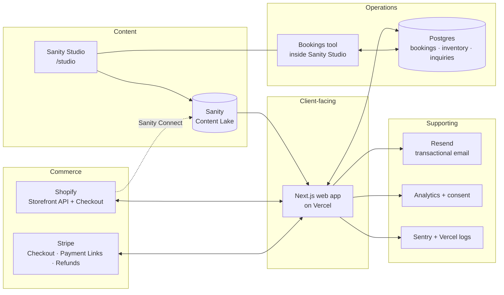

# Services

This file covers two views:

1. **Customer-facing services**: what the platform sells.
2. **Platform services**: the systems that deliver them, and which one owns what.

---

## 1. Customer-facing service catalogue (proposed, confirm via Q-B1)

| # | Service | Example | How it's sold | Payment rail | v1? |
|---|---|---|---|---|---|
| S1 | **Day tours & experiences** | Rīga Old Town & Art Nouveau walk; Gauja NP + Sigulda + Cēsis day trip; Rundāle Palace; Ķemeri bog boardwalk at sunrise; Jūrmala & Baltic coast | Fixed departures or time slots; per-person pricing with participant types (adult/child/senior); private option | **Stripe** | ✅ |
| S2 | **Private tours** | Private guide for 1–8 pax | Per-group price, on request or fixed slots | **Stripe** | ✅ |
| S3 | **Multi-day itineraries** | "Latvia in 5 days"; "Kurzeme coast & Kuldīga" | Pre-built itinerary with fixed start dates | **Stripe** (deposit + balance) | ⚠️ Depends on Package Travel status (Q-E1) |
| S4 | **Tailor-made trips** | Honeymoon, family, corporate/MICE | Inquiry → quote → deposit | **Stripe** (Payment Link / Invoice) | ✅ |
| S5 | **Airport & intercity transfers** | RIX → Rīga centre / Jūrmala | Slot + vehicle type | **Stripe** | ❓ Q-B1 |
| S6 | **Shop: physical products** | Printed guidebook, maps, Latvian crafts (linen, amber, ceramics), Laima/Black Balsam gift boxes | Catalogue + cart | **Shopify** checkout | ✅ |
| S7 | **Shop: digital products** | PDF itineraries, audio guides | Catalogue + cart, digital delivery | **Shopify** | ❓ Q-B1 |
| S8 | **Gift vouchers** | "Gift an experience" | Value or experience voucher | See ADR-004 | ❓ Q-B3 |
| S9 | **Editorial content** | Destination guides, seasonal content (Jāņi midsummer, Christmas markets), practical info | Free; drives SEO and conversion | n/a | ✅ |

Alcohol products (e.g. Black Balsam) have licensing and shipping restrictions. Confirm before listing (Q-B1).

---

## 2. Platform service map

### 2.1 System-of-record matrix

One owner per data type. Everything else reads from or caches that owner.

| Data | Owner (source of truth) | Read by | Notes |
|---|---|---|---|
| Destinations, guides, pages, SEO copy | **Sanity** | Web | Editors own it |
| Experience definition (title, description, media, itinerary, meeting point, inclusions, rate categories, base prices) | **Sanity** | Web, checkout API (price validation) | Price is re-read server-side at checkout |
| Schedules: recurrence, capacity, blackout dates, seasonal prices | **Sanity** | Postgres (slot generation on publish) | Marketer-editable; booking-safe guardrails (ADR-011) |
| Slots (materialised), holds, remaining capacity | **Postgres** | Web (availability), Studio Bookings tool | Transactional; never edited by hand |
| Promo codes | **Sanity** | Checkout API (validation), Postgres (redemptions) | Usage counts in Postgres |
| Redirects, announcement bar | **Sanity** | Vercel Edge Config → middleware | Updated on publish, no deploy |
| Transactional email copy | **Sanity** | Email service (React Email layout) | Layout locked in code |
| Marketing tags / pixels | **Google Tag Manager** | Browser (after consent) | Marketer-managed |
| Bookings, participants, booking status | **Postgres** | Back-office, emails | Stripe IDs stored for reconciliation |
| Payments, refunds, payouts | **Stripe** | Postgres (via webhooks) | Never trust client-side payment state |
| Shop products, variants, stock, prices | **Shopify** | Web (Storefront API), Sanity (via Connect, read-only) | Editorial enrichment in Sanity only |
| Shop orders, shipping, fulfilment | **Shopify** | Shopify admin | Not duplicated in Postgres in v1 |
| Tailor-made inquiries & quotes | **Postgres** | Back-office | Optional CRM sync in v2 |
| Media (photos, video) | **Sanity** assets | Web via Sanity image CDN | Shopify product images stay in Shopify |
| Translations (content) | **Sanity** (document-level i18n) | Web | Marketing UI labels in Sanity `uiStrings`; system strings (validation errors) in repo |

### 2.2 External services & accounts required

| Service | Purpose | Account owner | Plan (indicative) |
|---|---|---|---|
| GitHub | Code, CI | Client org (dev has access) | Free / Team |
| Vercel | Hosting, previews, cron, analytics | Client team | Pro |
| Sanity | CMS | Client org | Growth (or Free to start) |
| Shopify | Shop catalogue + checkout | Client legal entity | Basic or higher |
| Stripe | Booking and deposit payments | Client legal entity | Pay-as-you-go |
| Neon Postgres (via Vercel Marketplace) | Operational DB | Client (via Vercel) | Launch tier |
| Resend | Transactional email | Client | Pro |
| Sentry | Error monitoring | Client | Team |
| Domain registrar + DNS | Domain | Client | n/a |
| Maps (Mapbox or Google Maps) | Meeting points, destination maps | Client | Free tier to start |
| Consent management (e.g. Cookiebot / Klaro) | GDPR cookie consent (Consent Mode v2) | Client | Starter |
| Google Tag Manager + GA4 | Marketer-managed tags and analytics | Client (marketer) | Free |
| Uptime monitoring (e.g. Better Stack / Checkly) | Alerts to maintainer | Maintainer | Free / starter |
| Support retainer | Incidents, change requests, updates | Client ↔ agency | TBC (Q-F3) |
