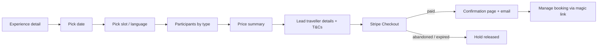

# Key Designs

What this document covers: the information architecture, core page templates, primary user flows, the component inventory and a **proposed** visual direction. The visual direction is a starting point only. It is replaced by the client's brand once D0.3 lands (Q-A3, Q-A4).

---

## 1. Design principles

1. **Inspire, then transact.** Big photography and storytelling up top. The booking action is always one tap away and never hidden.
2. **Honest price, early.** "From €X per person" on every card. The full price breakdown appears before payment. No drip pricing (EU consumer law).
3. **Mobile first.** 70 %+ of travel browsing is on mobile. The booking widget becomes a sticky bottom bar on small screens.
4. **Local authenticity.** Latvian place names keep their diacritics (Rīga, Cēsis, Kuldīga, Ķemeri). Real photography, no stock clichés.
5. **Accessible by default.** WCAG 2.1 AA, keyboard-complete booking flow, reduced-motion support.
6. **Fast.** Static or cached pages, optimised images, minimal client JS outside the booking widget and cart.
7. **Marketer-editable by default.** Every visible word, image, link and section comes from the CMS and is built from locked design-system blocks. A non-technical marketer can change it without breaking the layout (see [08-marketer-self-service.md](./08-marketer-self-service.md)).

---

## 2. Information architecture

```
/                                   Home
/destinations                       All destinations (map + list)
  /destinations/[region]            Region: Rīga · Vidzeme · Kurzeme · Zemgale · Latgale · Coast
    /destinations/[region]/[place]  Place: e.g. Sigulda, Cēsis, Kuldīga, Jūrmala, Liepāja
/experiences                        Listing + filters (type, region, duration, date, price)
  /experiences/[slug]               Experience detail + booking widget
/trips                              Multi-day itineraries
  /trips/[slug]                     Itinerary detail
/tailor-made                        Tailor-made landing + inquiry form
/guides                             Editorial hub (blog)
  /guides/[slug]                    Article
/plan                               Practical info hub (getting there, seasons, money, safety, FAQ)
/shop                               Shop home
  /shop/[collection]                Collection
  /shop/products/[handle]           Product detail
/cart                               Cart (drawer on desktop, page as fallback)
/booking/[ref]                      Manage booking (magic-link protected)
/booking/confirmation               Post-payment confirmation
/about · /contact · /legal/*        Static pages
/studio                             Sanity Studio: marketer workspace incl. Bookings tool
```

Locale prefix: `/{locale}/…` for non-default locales (e.g. `/de/experiences/...`). English is served at the root.

---

## 3. Page templates

| Template | Key modules (top → bottom) |
|---|---|
| **Home** | Hero (seasonal, CMS-driven) with search/"Find an experience" · Featured experiences carousel · Regions map teaser · "Why Latvia" storytelling band · Tailor-made CTA band · Latest guides · Shop highlights · Trust bar (reviews, secure payment, free cancellation policy) · Newsletter |
| **Region / Place** | Hero + intro · Quick facts (how to get there, best season, time from Rīga) · Top experiences here · Map with points of interest · Related guides · Nearby places |
| **Experience listing** | Filter bar (date, region, type, duration, price) · Result grid of ExperienceCards · Map toggle · Empty-state CTA to Tailor-made |
| **Experience detail** | Gallery · Title, rating, duration, languages, group size · **Booking widget** (desktop: sticky right rail; mobile: sticky bottom bar opening a sheet) · Highlights · Full description · Itinerary timeline · Included / not included · Meeting point map · What to bring · Cancellation policy · FAQ · Related experiences · Shop cross-sell |
| **Trip (multi-day)** | Hero · Day-by-day itinerary · Map route · Dates & prices table · Deposit terms · Inquiry/Book CTA |
| **Tailor-made** | Value proposition · How it works (3 steps) · Example trips · Multi-step inquiry form · Testimonials |
| **Guide article** | Hero · Portable Text body with embedded ExperienceCards / ProductCards / maps · Author · Related content |
| **Shop PDP** | Gallery · Title, price, variants · Add to cart · Description (Shopify) + story block (Sanity) · Shipping info · Related experiences |
| **Manage booking** | Booking summary · Participants · Meeting point & time · Add to calendar · Cancel/change request · Contact |

---

## 4. Primary user flows

### 4.1 Book an experience



The UX rule: a hold of up to 30 minutes is placed when the traveller proceeds to payment. A visible timer shows only in the last 5 minutes.

### 4.2 Buy from the shop

Product → Add to cart (drawer) → Checkout (Shopify-hosted, branded) → Shopify order confirmation → return link to site.

### 4.3 Tailor-made trip

Landing → multi-step form (dates, group, interests, budget, contact) → confirmation + email → ops qualifies in the Studio Bookings tool → quote sent (email with Stripe payment link for the deposit) → paid → trip confirmed.

### 4.4 Mixed intent (experience + shop)

The two checkouts stay separate (ADR-003). After a booking, the confirmation page shows curated shop cross-sell. The cart drawer shows a note: "Experiences are booked separately with instant confirmation."

---

## 5. Component inventory

**Primitives:** Button, Link, Icon, Badge, Tag, Input, Select, Checkbox, Radio, DatePicker, Stepper (±), Dialog/Sheet, Tabs, Accordion, Tooltip, Toast, Skeleton.

**Composites:**

| Component | Used on | Notes |
|---|---|---|
| `ExperienceCard` | Listing, home, guides | Image, region, title, duration, "from" price, rating, badges (bestseller, free cancellation) |
| `ProductCard` | Shop, guides, cross-sell | Shopify data, Sanity enrichment |
| `DestinationCard` | Home, destinations | |
| `BookingWidget` | Experience detail | Client component; availability via API; accessible calendar |
| `PriceBreakdown` | Widget, confirmation | Integer cents, EUR, VAT note |
| `ItineraryTimeline` | Experience, trip | |
| `MapBlock` | Place, experience, trip | Lazy-loaded; static image fallback |
| `CartDrawer` | Global | Shopify cart |
| `InquiryForm` | Tailor-made | Multi-step, saves progress locally |
| `PortableText` renderers | Guides, pages | Embeds cards, maps, callouts, galleries |
| `LocaleSwitcher`, `Header`, `Footer`, `Newsletter`, `TrustBar`, `ConsentBanner` | Global | |

The component library is built with **Tailwind CSS + shadcn/ui (Radix primitives)** for accessibility. Tokens are defined as CSS variables.

**Page-builder blocks** (the marketer's building kit) are listed in [08 §5](./08-marketer-self-service.md#5-page-builder-block-library). Every block ships with a Studio thumbnail, a description, defaults and a fixed set of variants. Designers design **blocks and variants**, not one-off pages.

---

## 6. Proposed visual direction: "Baltic Light" (placeholder until brand inputs arrive)

Inspired by the Latvian landscape: long northern light, pine forest, the Baltic sea, linen and amber.

| Token | Value | Use |
|---|---|---|
| `--color-ink` | `#1B2430` | Body text |
| `--color-forest` | `#1F4D3A` | Primary (pine forest) |
| `--color-sea` | `#2F6E8E` | Secondary / links (Baltic sea) |
| `--color-amber` | `#D98E04` | Accent / CTAs (amber) |
| `--color-carmine` | `#9E3039` | Sparing highlight (echoes the Latvian flag's carmine red) |
| `--color-linen` | `#F5F1E8` | Page background |
| `--color-sand` | `#E8DFCC` | Surfaces / cards |
| Display font | A characterful serif (e.g. *Fraunces*) | Headlines |
| Body font | A humanist sans (e.g. *Inter* / *Source Sans 3*) | UI and body |
| Radius | 12 px cards, 999 px pills | |
| Motifs | Subtle Latvian ornament (*zīmes*) as dividers | Use respectfully and sparingly |

All colour pairs must pass WCAG AA contrast. Amber on linen fails for body text, so amber is used only for CTAs with ink text on top.

Dark mode: not in v1 unless requested.

---

## 7. Design deliverables

1. Moodboard + 2 style tiles (week 1–2) → client picks one.
2. Figma: design tokens, component library, key templates (Home, Experience detail + booking widget, Listing, Guide, PDP, Tailor-made), mobile + desktop.
3. Clickable prototype of the booking flow for usability testing with 5 users.
4. Figma ↔ code: tokens exported to `src/styles/tokens.css`; Code Connect mapping for core components (optional).
5. Studio UX: task-based menu structure, block thumbnails, page templates, and handbook screenshots/videos for the marketer.
