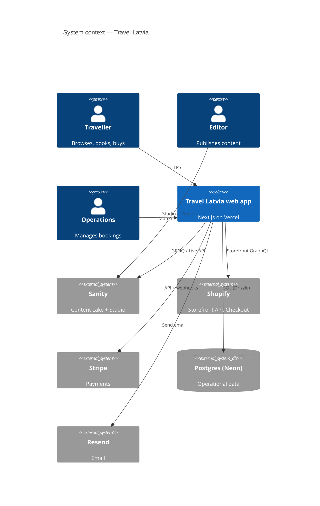
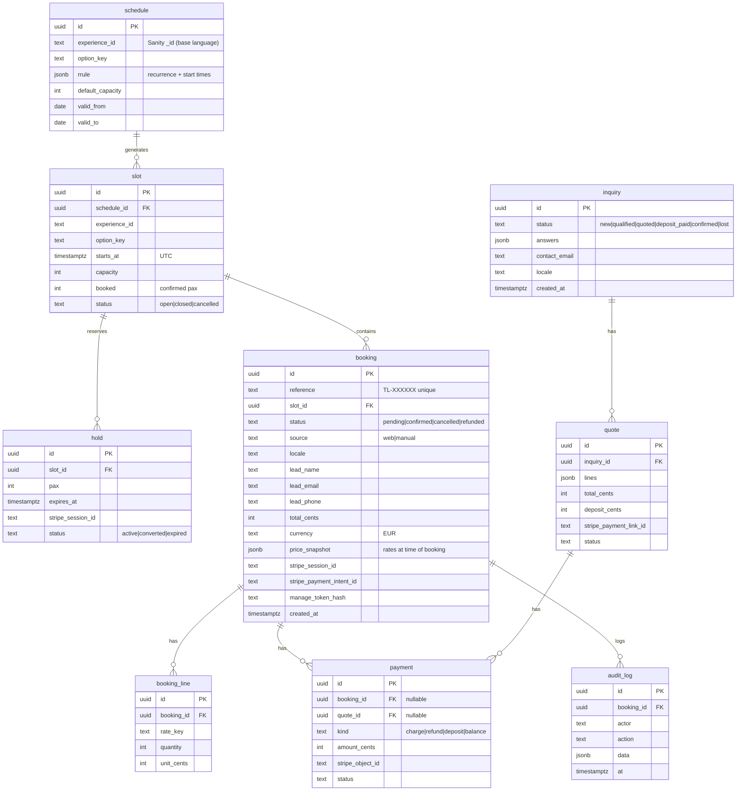

# Architecture

| | |
|---|---|
| **Version** | 0.1 (DRAFT) |
| **Date** | 2026-09-27 |
| **Scope** | v1 platform per [PRD](./05-prd.md) |

---

## 1. Summary

A **headless, composable** platform:

- **Next.js (App Router, TypeScript) on Vercel** renders the site. It also hosts the API routes, webhooks, cron jobs, the back-office (`/admin`) and the embedded Sanity Studio (`/studio`).
- **Sanity** owns editorial content and experience *definitions*.
- **Shopify** (Storefront API + hosted checkout) owns the shop.
- **Stripe** (Checkout, Payment Links, Refunds) owns booking and deposit payments.
- **Postgres** (Neon, provisioned through the Vercel Marketplace) owns *operational* data: inventory, holds, bookings and inquiries.

One rule governs the design: **every data type has exactly one system of record** (see [Services §2.1](./03-services.md#21-system-of-record-matrix)).

---

## 2. System context



---

## 3. Tech stack

| Layer | Choice | Why |
|---|---|---|
| Framework | **Next.js** (latest stable, App Router, React Server Components) | SSR/ISR, first-class on Vercel, Sanity & Shopify reference implementations |
| Language | **TypeScript** (strict) | Type safety across CMS/commerce boundaries |
| Styling / UI | **Tailwind CSS** + **shadcn/ui** (Radix) | Accessible primitives, fast iteration, token-driven |
| CMS | **Sanity** (Studio embedded, `next-sanity`, Presentation/Visual Editing, Live Content API, TypeGen) | Structured content, great editor UX, real-time preview |
| Shop | **Shopify** Storefront API (`@shopify/storefront-api-client`) + hosted checkout; **Sanity Connect** for product sync | Mature commerce and checkout without rebuilding it |
| Booking payments | **Stripe** Checkout Sessions, Payment Links / Invoices, Refunds, webhooks | Flexible and date-specific; supports deposits |
| Operational DB | **Postgres (Neon)** + **Drizzle ORM** + drizzle-kit migrations | Transactions and row locks for inventory; Vercel-native provisioning, branching per preview |
| Auth (back-office) | **Better Auth** (email magic link, roles), stored in Postgres | Self-hosted, no per-seat cost; Clerk is the alternative |
| Email | **Resend** + **React Email** | Typed, versioned templates in repo |
| i18n | **next-intl** (UI strings) + Sanity document-level i18n plugin | Localised routing, hreflang |
| Validation | **Zod** | All API input/output and env validation |
| Rate limit / bot | Vercel Firewall rules + **BotID** on checkout/inquiry; Upstash Ratelimit if needed | Abuse protection |
| Monitoring | **Sentry**, Vercel Observability, Speed Insights, Web Analytics | Errors, logs, CWV |
| Testing | **Vitest** (unit), **Playwright** (E2E), Stripe CLI for webhook tests | |
| Tooling | **pnpm**, ESLint, Prettier, Husky + lint-staged, GitHub Actions | |
| AI dev | **Claude Code** with GSD workflow; MCP servers: Sanity, Vercel, Stripe, Shopify Dev, GitHub | See `CLAUDE.md`, `.mcp.json` |

---

## 4. Repository structure (target)

```
travel-latvia/
├── CLAUDE.md                     # Claude Code project memory & rules
├── .mcp.json                     # MCP servers for Claude Code
├── .planning/                    # GSD: PROJECT, REQUIREMENTS, ROADMAP, STATE
├── docs/                         # Charter, PRD, architecture, design, questions
├── src/
│   ├── app/
│   │   ├── [locale]/(site)/      # Public pages (home, destinations, experiences, guides, shop…)
│   │   ├── [locale]/booking/     # Confirmation + manage booking
│   │   ├── admin/                # Back-office (auth-protected)
│   │   ├── studio/[[...tool]]/   # Embedded Sanity Studio
│   │   └── api/
│   │       ├── availability/     # GET slots for experience option + date range
│   │       ├── checkout/booking/ # POST → create hold + Stripe Checkout Session
│   │       ├── inquiries/        # POST tailor-made inquiry
│   │       ├── webhooks/stripe/  # Stripe events
│   │       ├── webhooks/shopify/ # Product/collection/inventory updates
│   │       ├── webhooks/sanity/  # Publish → revalidateTag
│   │       ├── draft-mode/       # Sanity Presentation enable/disable
│   │       └── cron/             # release-holds, reminders
│   ├── modules/                  # Domain logic, framework-agnostic, unit-tested
│   │   ├── booking/              # pricing, inventory, holds, references, policies
│   │   ├── payments/             # Stripe client, session builder, webhook handlers
│   │   ├── shop/                 # Shopify client, queries, cart
│   │   ├── content/              # Sanity client, GROQ queries, typed results
│   │   ├── inquiries/
│   │   └── email/                # React Email templates + send()
│   ├── components/               # ui/ (shadcn), blocks/ (page sections), booking/, shop/
│   ├── lib/                      # env (zod), logger, money, dates (Europe/Riga), auth
│   └── styles/tokens.css
├── sanity/
│   ├── sanity.config.ts
│   ├── schemaTypes/              # documents/, objects/, singletons/
│   └── structure.ts
├── db/
│   ├── schema.ts                 # Drizzle schema
│   └── migrations/
├── messages/                     # next-intl UI strings: en.json, lv.json, de.json…
├── tests/
│   ├── unit/
│   └── e2e/
└── .github/workflows/ci.yml
```

---

## 5. Data models

### 5.1 Sanity content model

| Type | Kind | Key fields |
|---|---|---|
| `siteSettings` | singleton | name, logo, nav, footer, social, legal entity details, default SEO |
| `homePage` | singleton | `sections[]` (modular blocks) |
| `region` | document | name, slug, intro, hero, geo (polygon/centre), places[] |
| `place` | document | name, slug, region→, intro, quickFacts{}, geo point, POIs[], hero, gallery |
| `experience` | document | title, slug, place→/region→, type (tour, activity, transfer…), summary, highlights[], description (PT), itinerary[], inclusions[], exclusions[], meetingPoint{name, geo, instructions}, durationMinutes, languages[], images[], cancellationPolicy→, faq[], **options[]** (see below), relatedExperiences[], relatedProducts[] (Shopify refs), seo |
| `experienceOption` (object) | object | `optionKey` (stable ID used by Postgres), name, private?, minPax, maxPax, minAge, cutoffHours, **rateCategories[]** {key, label, ageMin, ageMax, priceCents} |
| `trip` | document | title, slug, days[] {title, places[], description, overnight}, departures (from Postgres), deposit %, priceFromCents |
| `cancellationPolicy` | document | name, rules[] {hoursBefore, refundPercent}, legal text |
| `guide` | document | title, slug, category→, author→, hero, body (PT with embeds), related[] |
| `category`, `author` | document | |
| `page` | document | title, slug, sections[] (About, Contact, Legal…) |
| `faq` | document | question, answer, tags |
| `redirect` | document | from, to, permanent |
| `shopify.product` / `shopify.collection` | document (Sanity Connect, read-only core fields) | + editorial fields: story, pairings |
| Blocks | object | hero, experienceGrid, regionMap, ctaBand, guideList, productRail, richText, gallery, testimonial, faqBlock |

All localisable documents carry a `language` field (Sanity document-internationalization plugin) and are linked as translations.

### 5.2 Postgres operational model (Drizzle)



There is also a `webhook_event` table (`provider`, `event_id` UNIQUE, `processed_at`) for idempotency, plus the Better Auth tables for staff users.

**Capacity invariant:** `slot.booked + SUM(active holds.pax) ≤ slot.capacity`. It is enforced inside a transaction with `SELECT … FOR UPDATE` on the slot row.

---

## 6. Key flows

### 6.1 Booking checkout

```mermaid
sequenceDiagram
  autonumber
  participant U as Traveller
  participant W as Next.js (Vercel)
  participant DB as Postgres
  participant CMS as Sanity
  participant S as Stripe
  U->>W: GET /api/availability?experience&option&from&to
  W->>DB: slots + remaining capacity
  W-->>U: dates/slots
  U->>W: POST /api/checkout/booking {slotId, rates[], lead, consent}
  W->>CMS: fetch option & rates (published perspective)
  W->>W: validate (zod), compute price server-side, check cutoff/min/max
  W->>DB: BEGIN; SELECT slot FOR UPDATE; check capacity; INSERT hold (30 min) + booking(pending); COMMIT
  W->>S: checkout.sessions.create(line_items, metadata{bookingId, holdId}, expires_at=+30m, idempotency key)
  W-->>U: redirect to Stripe Checkout
  U->>S: pays (SCA)
  S-->>W: webhook checkout.session.completed
  W->>DB: dedupe event; BEGIN; hold→converted; slot.booked += pax; booking→confirmed; payment row; COMMIT
  W->>U: confirmation email (Resend) + ops alert
  S-->>W: webhook checkout.session.expired (if abandoned)
  W->>DB: hold→expired; booking→cancelled(expired)
```

Safety nets:

- The Vercel Cron job `release-holds` runs every 5 min and expires stale holds.
- The confirmation page polls the booking status and never trusts query params.
- A reconciliation job compares Stripe payments against bookings daily and alerts on mismatches.

### 6.2 Shop checkout

1. The browser calls a Server Action → Storefront `cartCreate` / `cartLinesAdd`. The cart ID is stored in an HTTP-only cookie.
2. The cart drawer reads the cart server-side.
3. "Checkout" redirects to `cart.checkoutUrl` (Shopify-hosted, branded).
4. Shopify handles payment, tax, shipping and order emails.
5. Shopify webhooks (`products/update`, `collections/update`, `inventory_levels/update`) → `/api/webhooks/shopify` (HMAC verified) → `revalidateTag('shopify:…')`.

### 6.3 Content publishing

Editor publishes in Studio → Sanity webhook (GROQ-filtered, signed) → `/api/webhooks/sanity` → `revalidateTag(<type>:<slug>)`. Preview deployments use Draft Mode + Visual Editing and the Live Content API.

### 6.4 Tailor-made quote

1. Inquiry POST (BotID + rate limit) → `inquiry` row → emails to the ops team and the traveller.
2. Ops builds a quote in `/admin`. The server creates a **Stripe Payment Link** (or Invoice) for the deposit, with `metadata.quoteId`.
3. Webhook → `payment` row → inquiry status becomes `deposit_paid`.

---

## 7. Caching & rendering strategy

| Route | Rendering | Invalidation |
|---|---|---|
| Content pages (home, regions, guides) | Static / cached (`use cache` + `cacheTag`) | Sanity webhook → tag revalidation |
| Experience detail | Cached shell; booking widget is a client component that fetches availability | Content: Sanity tag; availability: `no-store` or 60 s |
| Shop PLP/PDP | Cached | Shopify webhooks → tags; stock re-checked in cart |
| Cart, checkout API, admin, manage-booking | Dynamic, `no-store` | n/a |
| Images | Sanity image CDN (`@sanity/image-url`) + `next/image`; Shopify CDN for products | |

---

## 8. Environments & deployment

| Env | Git | Vercel | Sanity dataset | Postgres | Stripe | Shopify |
|---|---|---|---|---|---|---|
| Local | any branch | `vercel env pull` | `staging` | Neon dev branch | Test mode + Stripe CLI | Dev store |
| Preview | every PR | Preview deployment (protected) | `staging` | Neon branch per PR (Marketplace integration) | Test mode | Dev store |
| Production | `main` | Production (custom domain) | `production` | Neon `main` | Live mode | Live store |

**CI (GitHub Actions):** install → lint → typecheck → unit tests → build. Playwright E2E runs against the preview URL after deploy. Merges to `main` auto-deploy to production, gated by required checks and one review.

**Vercel Cron:** `*/5 * * * *` release-holds · `0 8 * * *` 48 h reminders (08:00 UTC ≈ 10:00/11:00 Riga, depending on DST) · `0 3 * * *` Stripe reconciliation.

### Environment variables

See [`.env.example`](../.env.example). All variables are validated at boot by `src/lib/env.ts` (Zod). Secrets live only in Vercel env settings.

---

## 9. Analytics events

| Event | Where fired | Properties |
|---|---|---|
| `view_experience` | Client | experience_id, region, price_from |
| `select_date` / `select_slot` | Client | experience_id, date, option |
| `begin_checkout` | Server (session created) | booking_id, value_cents, pax |
| `booking_paid` | Server (webhook) | booking_id, value_cents, experience_id |
| `add_to_cart` / `shop_checkout` | Client | product handle, value |
| `inquiry_submitted` | Server | budget band, travellers |

Client events fire only after consent. Server events are first-party and contain no PII.

---

## 10. Security & privacy

- Secrets are stored in Vercel env only. Nothing prefixed `NEXT_PUBLIC_` is secret.
- Webhooks: Stripe signature (`stripe.webhooks.constructEvent`), Shopify HMAC, Sanity signature. Each is idempotent via `webhook_event`.
- Admin: Better Auth sessions, role checks in middleware **and** in every server action/route. Staff access is invite-only.
- Manage-booking links: random 32-byte token; only the SHA-256 hash is stored; links expire after trip date + 30 days.
- Input validation with Zod everywhere. Parameterised SQL via Drizzle.
- Security headers (CSP incl. Stripe/Shopify/Sanity domains, HSTS, frame-ancestors). Studio is allowed to frame the site on preview only.
- PII is limited to the lead traveller's name/email/phone. Retention jobs apply NFR-05. DPAs are signed with Vercel, Sanity, Shopify, Stripe, Neon, Resend and Sentry.

---

## 11. Observability & operations

- Sentry for client and server errors, with source maps uploaded in CI.
- Alerts: webhook failure rate, 5xx rate, reconciliation mismatches, cron failures.
- Runbooks (in `docs/runbooks/`, written in Phase 6): refund a booking, handle a Stripe dispute, restore Postgres from a backup, roll back a deployment.

---

## 12. Cost envelope (monthly, indicative, verify at purchase)

| Item | Indicative |
|---|---|
| Vercel Pro | ~$20 per seat |
| Sanity Growth | ~$15 per seat (Free plan may suffice at start) |
| Shopify Basic | ~$29–39 + payment fees |
| Stripe | Per transaction (EEA standard cards ≈ 1.5 % + €0.25; verify for LV entity) |
| Neon (via Vercel) | $0–19 at launch scale |
| Resend | $0–20 |
| Sentry | $0–26 |
| **Platform total (excl. transaction fees)** | **≈ $100–200 / month** at launch scale |

---

## 13. Architecture Decision Records

| ADR | Decision | Status |
|---|---|---|
| **ADR-001** | Next.js App Router on Vercel as the single web runtime (site, API, admin, Studio). | Proposed |
| **ADR-002** | **Sanity** as the CMS. Alternatives: Shopify metaobjects (too weak for editorial), Contentful (cost, weaker preview DX). | Proposed |
| **ADR-003** | **Split commerce:** Shopify for the shop; Stripe for experience bookings. *Why not bookings in Shopify?* Shopify has no native date/slot inventory. Booking apps add fees, limit UX and fragment data. *Trade-off:* two checkouts; one basket can't hold a shop item and a booking together. Revisit if the client needs a unified basket (Q-B2). | **Needs client input** |
| **ADR-004** | **Gift vouchers.** Option A: Shopify gift cards (shop only, can't redeem against Stripe bookings). Option B: vouchers issued as Stripe promotion codes, sold through Stripe Checkout, redeemable on bookings. Option C: a voucher table in Postgres, redeemable on both (most work). Recommend **B** for v1. | **Needs client input** (Q-B3) |
| **ADR-005** | **Build a lightweight booking engine** (Postgres + Stripe) rather than buy one (Bókun, FareHarbor, Rezdy, Regiondo). This fits a single operator with fewer than ~50 products and no OTA distribution. **Buy** instead if the client needs channel distribution to Viator/GetYourGuide/Expedia, resource/guide scheduling or multiple suppliers. In that case the booking system becomes the source of truth and Stripe is its gateway. | **Needs client input** (Q-B6) |
| **ADR-006** | Postgres (Neon via Vercel Marketplace) + Drizzle for operational data; not Sanity (no transactions or locks) and not Shopify. | Proposed |
| **ADR-007** | Better Auth for staff-only back-office; no customer accounts in v1. | Proposed |
| **ADR-008** | Resend + React Email for transactional email; templates versioned in repo. | Proposed |
| **ADR-009** | Stripe Checkout (hosted), not embedded Payment Element, for v1: less PCI scope, SCA handled, fastest to ship. Embedded Checkout remains an option. | Proposed |

**Payment gateway caveat:** confirm which payment providers Shopify offers the client's legal entity. If Shopify Payments isn't available in its country, a third-party gateway adds Shopify transaction fees (Q-E3).
